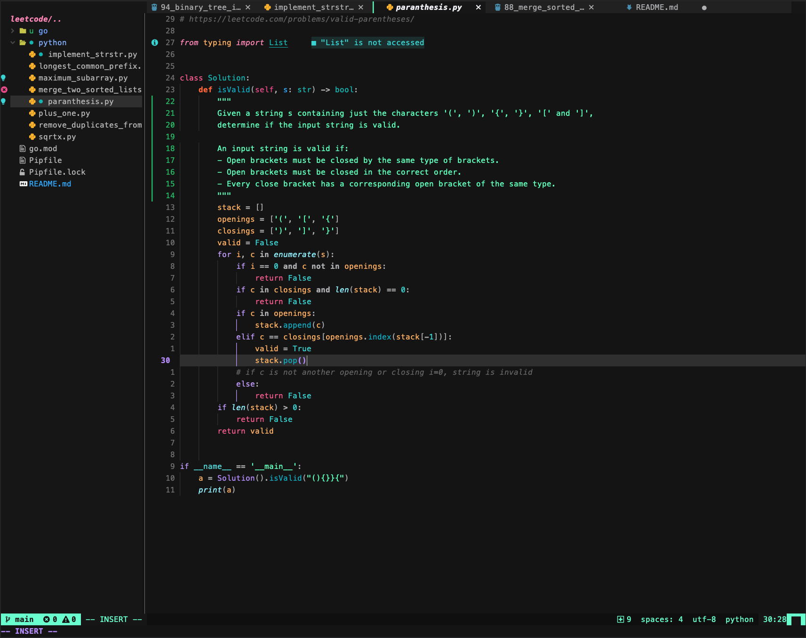

# Noctis for Neovim

A neovim port of Noctis theme for VSCode with TreeSitter support.



## Installation

| Plugin Manager                                       | Command                                                                            |
| ---------------------------------------------------- | ---------------------------------------------------------------------------------- |
| [Packer](https://github.com/wbthomason/packer.nvim)  | `use 'kartikp10/noctis.nvim'`                                                      |
| [Vim-plug](https://github.com/junegunn/vim-plug)     | `Plug 'kartikp10/noctis.nvim'`                                                     |
| [NeoBundle](https://github.com/Shougo/neobundle.vim) | `NeoBundle 'kartikp10/noctis.nvim'`                                                |
| [Vundle](https://github.com/VundleVim/Vundle.vim)    | `Bundle 'kartikp10/noctis.nvim'`                                                   |
| [Pathogen](https://github.com/tpope/vim-pathogen)    | `git clone https://github.com/kartikp10/noctis.nvim.git ~/.vim/bundle/noctis.nvim` |
| [Dein](https://github.com/Shougo/dein.vim)           | `call dein#add('kartikp10/noctis.nvim')`                                           |

## Usage

```viml
syntax on
colorscheme noctis
```

## Supported Plugins

1. TreeSitter
2. Telescope
3. Lualine
4. Bufferline
5. NvimTree
